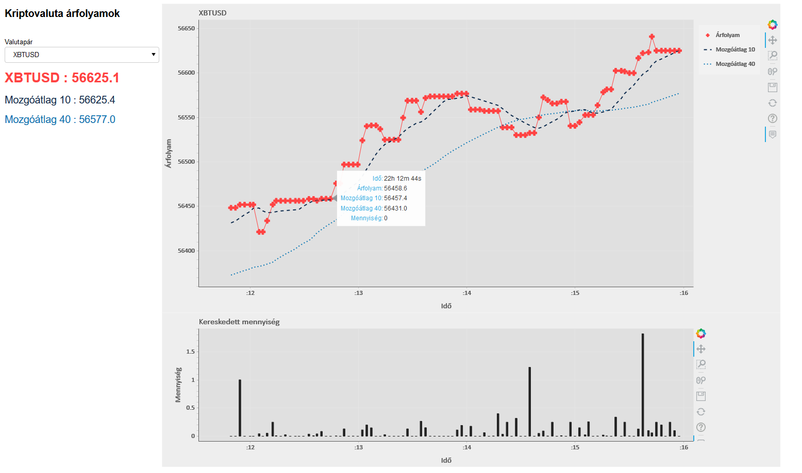
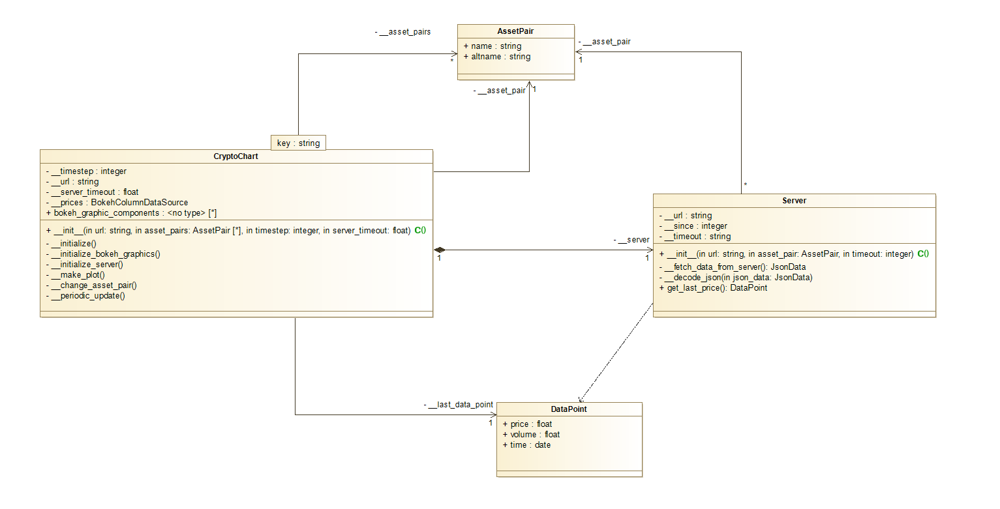

Kriptovaluta árfolyam megjelenítő
----------------------------------

A program egy kriptovaluta tőzsde kereskedési adatait kéri le 2-3 másodperces időközökkel és jeleníti meg egy automatikusan frissülő grafikonon.

#### A program grafikus felülete:

Bitcoin árfolyama USA Dollárban:



#### Futtatáshoz szükséges környezet

A program futtatásához egy telepített [Python3](https://www.python.org/) környezeten kívül még a következő csomagokra is szükséged van:  
(ezeket az általad használt python csomagkezelő segítségével tudod telepíteni)

- bokeh
- numpy
- pandas
- requests

Én a program fejlesztését `Windows 10` operációs rendszeren végeztem `Python 3.9.1` környezetben, ahol a fenti szükséges python csomagok a következő verziószámúak voltak:

| Csomag        | Verziószám   |
|---------------|--------------|
| bokeh         | 2.2.3        |
| numpy         | 1.20.1       |
| pandas        | 1.2.2        |
| requests      | 2.25.1       |

Ezen kívül `Ubuntu 18.04` operációs rendszeren `Python 3.6.9` verziójú python környezetben is végeztem néhány teszt futtatást.

A lentebbi leírás a windows-os futtatásról szól, más rendszereken futtatni ehhez hasonlóan lehet, az operációs rendszer függő parancsokat esetleg módosítani kell.

A program teljes mapparendszere az alábbi ábrának megfelelően néz ki, ahol a letöltött tároló gyökérkönyvtárát jelöltem `./` jellel (ez a mappa tartalmazza a `run.bat` fájlt):

```
./
|
+---crypto_price_viewer/
|   |
|   +---scripts/
|   |   |
|   |   +---__init__.py
|   |   |
|   |   +---cryptochart.py
|   |   |
|   |   +---server.py
|   |
|   +---main.py
|
+---run.bat
```

#### A program indítása

A `crypto_price_viewer` mappában található a Bokeh szerver által elvárt `main.py` modul. Ezért a programot az e mappa fölötti `run.bat` fájlt tartalmazó `./` mappából tudod elindítani a parancssorban begépelt
```
bokeh serve --show crypto_price_viewer
```
paranccsal. Ezt a parancsot ezen a helyen a `run.bat` windows parancssori szkriptben is elhelyeztem, tehát ezt futtatva is elindul a program.

A parancs kiadása után a program megpróbál kapcsolódni a kriptovaluta tőzsde szerveréhez, és ha ez sikerül, akkor az alapértelmezett webböngésző új lapján megnyitva jelenik meg a program grafikus felülete. (Sikertelen csatlakozás esetén a program hibaüzenet ír ki a parancssorra és leáll.)

#### A program működésének bemutatása

A grafikus felület betöltődése után a program egyenletes időközönként (jelenleg ez 2,5 másodperc) megpróbálja letölteni a [kraken.com](https://www.kraken.com/) kriptovaluta tőzsde legutolsó Bitcoin-USA Dollár (XBTUSD) valutapárra vonatkozó kereskedéseinek [publikusan elérhető adatait](https://www.kraken.com/features/api#get-recent-trades).
Amennyiben ez sikerül, akkor ennek az időintervallumnak a (kereskedett mennyiségekkel súlyozott) átlagárát újabb adatpontként jeleníti meg a felső grafikonon, a kereskedett mennyiséget pedig az alsó oszlopdiagramon.

Amennyiben a szerver meghatározott időn belül (a jelenlegi beállítással ez 4 másodperc) nem elérhető, vagy nem értelmezhető adatokat küld, vagy az utolsó lekérdezés óta nincs újabb kereskedési adat, akkor a grafikonokon a legutolsó érvényes árfolyam jelenik meg a következő időpontban is, valamint a hozzá tartozó kereskedett mennyiség 0 lesz az oszlopdiagramon (A fenti három esetből az első kettőben rövid hibaüzenet is megjelenik a parancssori felületen.).

A pillanatnyi adatokon kívül még az előző 10 darab, illetve előző 40 darab árfolyam adatból számolt mozgóátlagot is felrajzolja a program az automatikusan frissülő grafikonra. Az utolsó árfolyamérték valamint a két mozgóátlag aktuális értéke a grafikontól balra számként is megjelenítésre kerül.

A program jelenlegi beállításaival az elmúlt 100 lekérdezés árfolyam adata lesz megjelenítve és eltárolva egy FIFO listában, ezt követően az újabb adatok folyamatosan kiszorítják a régebbieket a listából.

###### Felhasználói interaktivitás

A Bokeh grafikon beépített eszközeit használva a grafikon megjelenítési tartományát tudod mozgatni, nagyítani, kicsinyíteni és resetelni is, az egérkurzort a adatpontok fölé helyezve, pedig egy tooltippen jelennek meg az adott ponthoz tartozó adatok. A grafikon jobb felső sarkában lévő jelmagyarázatra kattintva a két darab mozgóátlag megjelenítését ki és be tudod kapcsolni. Az aktuálisan megjelenített grafikont PNG formátumban tudod elmenteni.

A bal felső sarokban lévő legördülő listában lehet váltani másik valutapárra (jelenleg 2 darab valódi valutapár: Bitcoin-USD és Bitcoin-Euro, valamint 1 darab nem valódi, offline generált adatokat létrehozó "DEMO" valutapár adatait lehet kiválasztani). Új valutapár kiválasztása után a korábbi grafikonok törlődnek és az új adatok lesznek megjelenítve.

A programot megállítani a parancssorban CTRL+C billentyűkombinációval illetve a böngészőlap bezárásával lehet.

#### Főbb komponenseket tartalmazó osztálydiagram:

Mellékelem még a program belső szerkezetét nagy vonalakban bemutató osztálydiagramot is.



